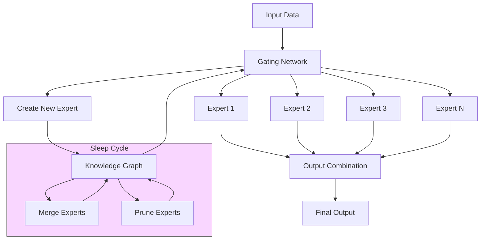
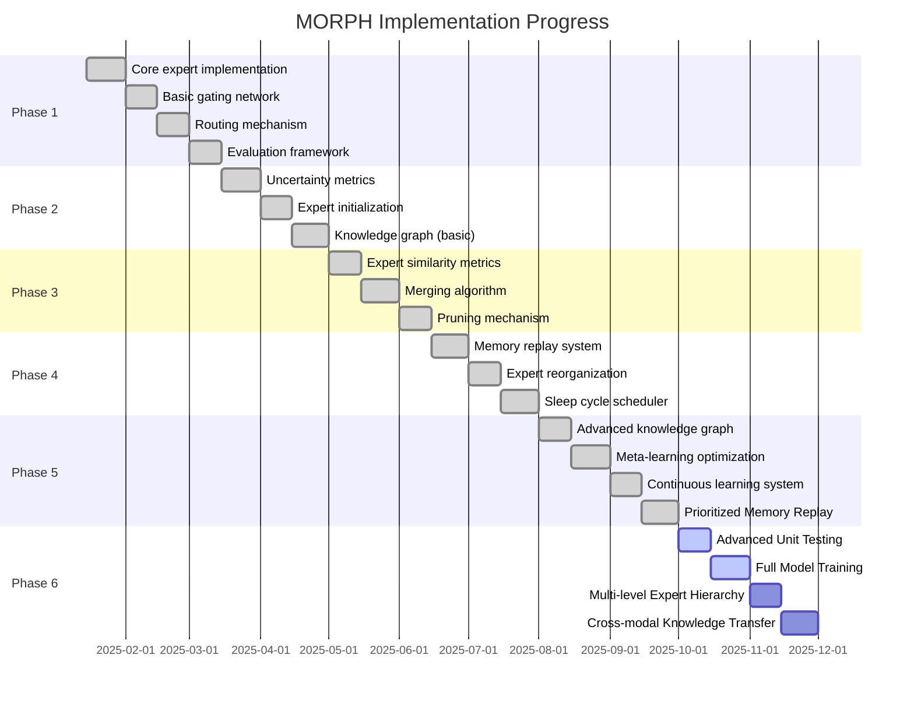
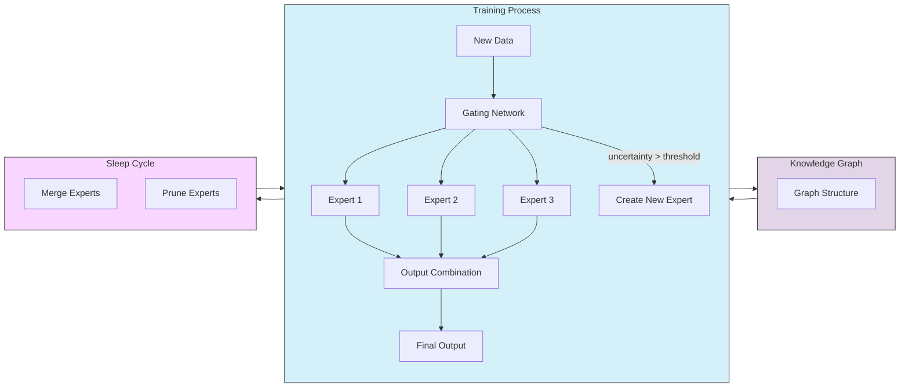

# MORPH: Mixture Of experts with Recursive Post-processing & Hierarchy

[](https://opensource.org/licenses/MIT)

MORPH is a novel neural network architecture implementing a **Dynamic Mixture of Experts (MoE)** model with continuous learning capabilities, adaptive expert creation, and brain-inspired post-processing mechanisms.

## Key Features

- **Dynamic Expert Creation**: Automatically generates new expert networks when existing ones underperform
- **Knowledge Graph Routing**: Routes inputs based on semantic similarity using a graph-based knowledge structure
- **Expert Consolidation**: Periodically merges similar experts to optimize memory and prevent redundancy
- **Sleep Function**: Implements a brain-inspired post-processing mechanism for knowledge consolidation
- **Continuous Learning**: Designed to learn incrementally without catastrophic forgetting
- **GPU Acceleration**: Supports automatic GPU detection, multi-GPU training, and mixed precision

## Architecture Overview



MORPH consists of four main components:

1. **Experts**: Specialized neural networks trained on specific subtasks or data distributions
2. **Gating Network**: Determines which experts to activate for each input
3. **Knowledge Graph**: Tracks relationships between experts and concepts
4. **Sleep Module**: Handles periodic knowledge consolidation and optimization

## Getting Started

### Prerequisites

- Python 3.8+
- PyTorch 1.12+
- NetworkX 2.8+
- PyTorch Lightning (optional, for training utilities)

### Installation

```bash
# Clone the repository
git clone https://github.com/yourusername/project-morph.git
cd project-morph

# Create and activate virtual environment (recommended)
python -m venv venv
source venv/bin/activate  # On Windows: venv\Scripts\activate

# Install dependencies
pip install -r requirements.txt

# Install development dependencies (for contributing)
pip install -e ".[dev]"
```

### Example Usage

```python
from morph.core.model import MorphModel
from morph.config import MorphConfig

# Initialize MORPH model
config = MorphConfig(
    input_size=784,  # Input feature size
    expert_hidden_size=256,
    output_size=10,  # Output size
    num_initial_experts=4,
    expert_k=2,
    enable_dynamic_experts=True,
    
    # Sleep cycle settings
    enable_sleep=True,
    sleep_cycle_frequency=1000,
    enable_meta_learning=True
)
model = MorphModel(config)

# Setup training
import torch.nn as nn
import torch.optim as optim

criterion = nn.CrossEntropyLoss()
optimizer = optim.Adam(model.parameters(), lr=0.001)

# Train the model
for epoch in range(10):
    for inputs, targets in train_loader:
        # Perform training step
        metrics = model.train_step((inputs, targets), optimizer, criterion)
        print(f"Loss: {metrics['loss']:.4f}, Accuracy: {metrics['accuracy']:.2f}%")
    
    # Sleep cycle will be automatically triggered based on steps
    # Or force a sleep cycle
    model.sleep()
    
    # Evaluate
    eval_metrics = model.evaluate(test_loader, criterion, device)
    print(f"Test accuracy: {eval_metrics['accuracy']:.2f}%")
```

## GPU Acceleration

MORPH supports GPU acceleration for faster training and inference:

```python
# Configure GPU settings
config = MorphConfig(
    # ... other settings ...
    
    # GPU settings
    gpu_mode="auto",  # "auto", "cpu", "single_gpu", "multi_gpu"
    parallel_strategy="data_parallel",  # "data_parallel", "expert_parallel"
    enable_mixed_precision=True,  # Use mixed precision for faster training
    auto_batch_size=True,  # Automatically determine optimal batch size
)
```

For multi-GPU training, MORPH supports two parallelization strategies:

1. **Data Parallel**: Distributes batches across multiple GPUs
2. **Expert Parallel**: Distributes experts across multiple GPUs

See [examples/README_GPU.md](examples/README_GPU.md) for detailed GPU usage instructions.

## Implementation Progress

MORPH is being implemented in five phases:



Current status:

| Component | Status | Progress |
|-----------|--------|----------|
| Core Experts | ✅ Complete | 100% |
| Gating Network | ✅ Complete | 100% |
| Routing Mechanism | ✅ Complete | 100% |
| Dynamic Expert Creation | ✅ Complete | 100% |
| Knowledge Graph (Basic) | ✅ Complete | 100% |
| Expert Merging | ✅ Complete | 100% |
| Expert Pruning | ✅ Complete | 100% |
| Knowledge Graph (Advanced) | ✅ Complete | 100% |
| Sleep Module (Memory Replay) | ✅ Complete | 100% |
| Sleep Module (Meta Learning) | ✅ Complete | 100% |
| Continuous Learning | ✅ Complete | 100% |
| Prioritized Memory Replay | ✅ Complete | 100% |
| Expert Reorganization | ✅ Complete | 100% |
| Concept Drift Detection | ✅ Complete | 100% |
| GPU Acceleration | ✅ Complete | 100% |

See the [PROJECT_PLAN.md](PROJECT_PLAN.md) for detailed implementation steps.

## Examples

### Continual Learning

MORPH excels at continual learning tasks where the data distribution changes over time. The `examples/continual_learning_example.py` demonstrates this capability by training on a sequence of rotated MNIST tasks:

```bash
# Run the continual learning example
python examples/continual_learning_example.py
```

This example:
1. Creates a sequence of 5 tasks with increasingly rotated MNIST digits
2. Trains the model sequentially on each task
3. Measures catastrophic forgetting on previous tasks
4. Visualizes how experts are created and specialized during training

### GPU Training

The `examples/gpu_training_example.py` demonstrates how to use GPU acceleration with MORPH:

```bash
# Basic usage with automatic GPU detection
python examples/gpu_training_example.py

# Use multiple GPUs with expert parallel strategy
python examples/gpu_training_example.py --gpu-mode multi_gpu --parallel-strategy expert_parallel

# Enable mixed precision training
python examples/gpu_training_example.py --mixed-precision
```

See [examples/README_GPU.md](examples/README_GPU.md) for more details.

## Documentation

- [Architecture Design](docs/architecture.md)
- [API Reference](docs/api.md)
- [Examples](examples/README.md)

## Development

### Build & Test Commands

```bash
# Run all tests
python -m pytest tests/

# Run a specific test file
python -m pytest tests/test_expert.py

# Run a specific test
python -m pytest tests/test_expert.py::test_expert_initialization

# Format code with Black
python -m black morph/ tests/

# Sort imports
python -m isort morph/ tests/

# Run type checking
python -m mypy morph/

# Run linting
python -m flake8 morph/ tests/
```

See [CLAUDE.md](CLAUDE.md) for more detailed development guidelines.

## Visualization of the MORPH Approach



The diagram above shows how the three key mechanisms of MORPH (training, knowledge graph management, and sleep cycles) interact to create a dynamic, adaptive system.

## Contributing

Contributions are welcome! Please feel free to submit a Pull Request.

## License

This project is licensed under the MIT License - see the [LICENSE](LICENSE) file for details.

## Citation

If you use MORPH in your research, please cite:

```bibtex
@misc{morph2025,
  author = {Berkebile, Samuel},
  title = {MORPH: Mixture Of experts with Recursive Post-processing & Hierarchy},
  year = {2025},
  publisher = {GitHub},
  journal = {GitHub repository},
  howpublished = {\url{https://github.com/yourusername/project-morph}}
}
