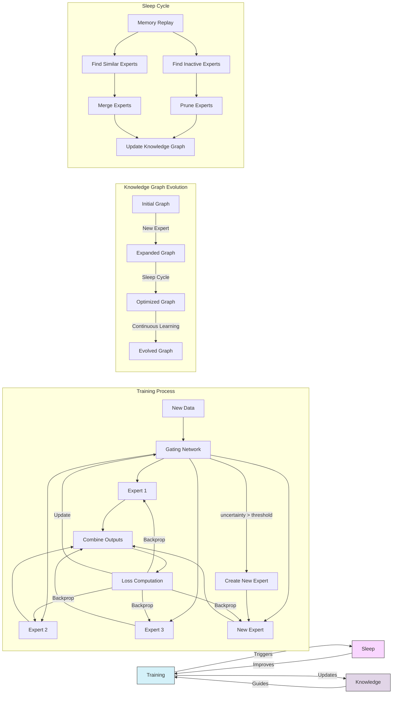

# MORPH: Mixture Of experts with Recursive Post-processing & Hierarchy

[](https://opensource.org/licenses/MIT)

MORPH is a novel neural network architecture implementing a **Dynamic Mixture of Experts (MoE)** model with continuous learning capabilities, adaptive expert creation, and brain-inspired post-processing mechanisms.

## Key Features

- **Dynamic Expert Creation**: Automatically generates new expert networks when existing ones underperform
- **Knowledge Graph Routing**: Routes inputs based on semantic similarity using a graph-based knowledge structure
- **Expert Consolidation**: Periodically merges similar experts to optimize memory and prevent redundancy
- **Sleep Function**: Implements a brain-inspired post-processing mechanism for knowledge consolidation
- **Continuous Learning**: Designed to learn incrementally without catastrophic forgetting

## Architecture Overview

```mermaid
graph TD
    Input[Input Data] --> Gating[Gating Network]
    Gating --> |Route| E1[Expert 1]
    Gating --> |Route| E2[Expert 2]
    Gating --> |Route| E3[Expert 3]
    Gating --> |Route| EN[Expert N]
    
    E1 --> Combine[Output Combination]
    E2 --> Combine
    E3 --> Combine
    EN --> Combine
    
    Combine --> Output[Final Output]
    
    Gating --> |High Uncertainty| Create[Create New Expert]
    Create --> KG[Knowledge Graph]
    
    subgraph "Sleep Cycle"
        KG --> |Periodic| Merge[Merge Similar Experts]
        KG --> |Periodic| Prune[Prune Dormant Experts]
        Merge --> KG
        Prune --> KG
    end
    
    KG --> |Update Routing| Gating
    
    class Sleep Cycle sleep;
    
    classDef sleep fill:#f9f,stroke:#333,stroke-width:2px;
```

MORPH consists of four main components:

1. **Experts**: Specialized neural networks trained on specific subtasks or data distributions
2. **Gating Network**: Determines which experts to activate for each input
3. **Knowledge Graph**: Tracks relationships between experts and concepts
4. **Sleep Module**: Handles periodic knowledge consolidation and optimization

## Getting Started

### Prerequisites

- Python 3.8+
- PyTorch 1.12+
- NetworkX 2.8+
- PyTorch Lightning (optional, for training utilities)

### Installation

```bash
# Clone the repository
git clone https://github.com/yourusername/project-morph.git
cd project-morph

# Create and activate virtual environment (recommended)
python -m venv venv
source venv/bin/activate  # On Windows: venv\Scripts\activate

# Install dependencies
pip install -r requirements.txt
```

### Example Usage

```python
from morph.model import MorphModel
from morph.config import MorphConfig

# Initialize MORPH model
config = MorphConfig(
    num_initial_experts=4,
    expert_hidden_size=256,
    enable_dynamic_experts=True,
    sleep_cycle_frequency=1000
)
model = MorphModel(config)

# Train model
model.train(train_dataset, epochs=10)

# Sleep cycle for consolidation
model.sleep()

# Continue training with new data
model.train(new_dataset, epochs=5)
```

## Implementation Progress

MORPH is being implemented in four phases:

```mermaid
gantt
    title MORPH Implementation Progress
    dateFormat  YYYY-MM-DD
    section Phase 1: Basic MoE
    Core expert implementation   :done, p1_1, 2025-01-15, 2025-02-01
    Basic gating network         :done, p1_2, 2025-02-01, 2025-02-15
    Routing mechanism            :active, p1_3, 2025-02-15, 2025-03-01
    Evaluation framework         :pending, p1_4, 2025-03-01, 2025-03-15
    
    section Phase 2: Dynamic Experts
    Uncertainty metrics          :pending, p2_1, 2025-03-15, 2025-04-01
    Expert initialization        :pending, p2_2, 2025-04-01, 2025-04-15
    Knowledge graph (basic)      :pending, p2_3, 2025-04-15, 2025-05-01
    
    section Phase 3: Optimization
    Expert similarity metrics    :pending, p3_1, 2025-05-01, 2025-05-15
    Merging algorithm            :pending, p3_2, 2025-05-15, 2025-06-01
    Pruning mechanism            :pending, p3_3, 2025-06-01, 2025-06-15
    
    section Phase 4: Sleep Function
    Memory replay system         :pending, p4_1, 2025-06-15, 2025-07-01
    Expert reorganization        :pending, p4_2, 2025-07-01, 2025-07-15
    Sleep cycle scheduler        :pending, p4_3, 2025-07-15, 2025-08-01
```

Current status:

| Component | Status | Progress |
|-----------|--------|----------|
| Core Experts | ✅ Complete | 100% |
| Gating Network | ✅ Complete | 100% |
| Routing Mechanism | 🔄 In Progress | 60% |
| Knowledge Graph | ⏱️ Not Started | 0% |
| Sleep Module | ⏱️ Not Started | 0% |

See the [PROJECT_PLAN.md](PROJECT_PLAN.md) for detailed implementation steps.

## Documentation

- [Architecture Design](docs/architecture.md)
- [API Reference](docs/api.md)
- [Examples](examples/README.md)

## Visualization of the MORPH Approach



The diagram above shows how the three key mechanisms of MORPH (training, knowledge graph management, and sleep cycles) interact to create a dynamic, adaptive system.

## Contributing

Contributions are welcome! Please feel free to submit a Pull Request.

## License

This project is licensed under the MIT License - see the [LICENSE](LICENSE) file for details.

## Citation

If you use MORPH in your research, please cite:

```bibtex
@misc{morph2025,
  author = {Project MORPH Contributors},
  title = {MORPH: Mixture Of experts with Recursive Post-processing & Hierarchy},
  year = {2025},
  publisher = {GitHub},
  journal = {GitHub repository},
  howpublished = {\url{https://github.com/yourusername/project-morph}}
}
```
