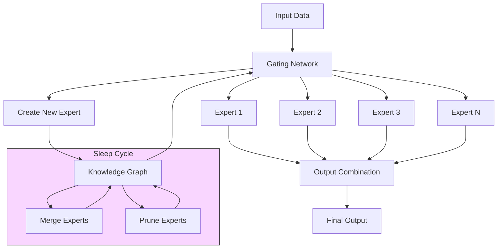
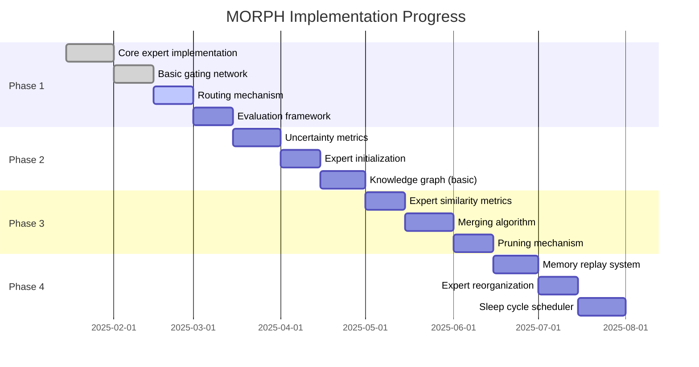
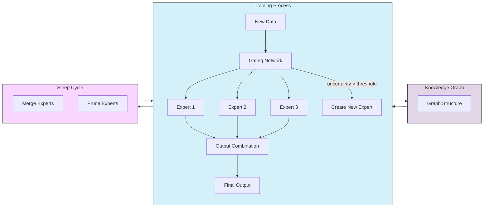

# MORPH: Mixture Of experts with Recursive Post-processing & Hierarchy

[](https://opensource.org/licenses/MIT)

MORPH is a novel neural network architecture implementing a **Dynamic Mixture of Experts (MoE)** model with continuous learning capabilities, adaptive expert creation, and brain-inspired post-processing mechanisms.

## Key Features

- **Dynamic Expert Creation**: Automatically generates new expert networks when existing ones underperform
- **Knowledge Graph Routing**: Routes inputs based on semantic similarity using a graph-based knowledge structure
- **Expert Consolidation**: Periodically merges similar experts to optimize memory and prevent redundancy
- **Sleep Function**: Implements a brain-inspired post-processing mechanism for knowledge consolidation
- **Continuous Learning**: Designed to learn incrementally without catastrophic forgetting

## Architecture Overview



MORPH consists of four main components:

1. **Experts**: Specialized neural networks trained on specific subtasks or data distributions
2. **Gating Network**: Determines which experts to activate for each input
3. **Knowledge Graph**: Tracks relationships between experts and concepts
4. **Sleep Module**: Handles periodic knowledge consolidation and optimization

## Getting Started

### Prerequisites

- Python 3.8+
- PyTorch 1.12+
- NetworkX 2.8+
- PyTorch Lightning (optional, for training utilities)

### Installation

```bash
# Clone the repository
git clone https://github.com/yourusername/project-morph.git
cd project-morph

# Create and activate virtual environment (recommended)
python -m venv venv
source venv/bin/activate  # On Windows: venv\Scripts\activate

# Install dependencies
pip install -r requirements.txt
```

### Example Usage

```python
from morph.model import MorphModel
from morph.config import MorphConfig

# Initialize MORPH model
config = MorphConfig(
    num_initial_experts=4,
    expert_hidden_size=256,
    enable_dynamic_experts=True,
    sleep_cycle_frequency=1000
)
model = MorphModel(config)

# Train model
model.train(train_dataset, epochs=10)

# Sleep cycle for consolidation
model.sleep()

# Continue training with new data
model.train(new_dataset, epochs=5)
```

## Implementation Progress

MORPH is being implemented in four phases:



Current status:

| Component | Status | Progress |
|-----------|--------|----------|
| Core Experts | ✅ Complete | 100% |
| Gating Network | ✅ Complete | 100% |
| Routing Mechanism | 🔄 In Progress | 60% |
| Knowledge Graph | ⏱️ Not Started | 0% |
| Sleep Module | ⏱️ Not Started | 0% |

See the [PROJECT_PLAN.md](PROJECT_PLAN.md) for detailed implementation steps.

## Documentation

- [Architecture Design](docs/architecture.md)
- [API Reference](docs/api.md)
- [Examples](examples/README.md)

## Visualization of the MORPH Approach



The diagram above shows how the three key mechanisms of MORPH (training, knowledge graph management, and sleep cycles) interact to create a dynamic, adaptive system.

## Contributing

Contributions are welcome! Please feel free to submit a Pull Request.

## License

This project is licensed under the MIT License - see the [LICENSE](LICENSE) file for details.

## Citation

If you use MORPH in your research, please cite:

```bibtex
@misc{morph2025,
  author = {Project MORPH Contributors},
  title = {MORPH: Mixture Of experts with Recursive Post-processing & Hierarchy},
  year = {2025},
  publisher = {GitHub},
  journal = {GitHub repository},
  howpublished = {\url{https://github.com/yourusername/project-morph}}
}
```
