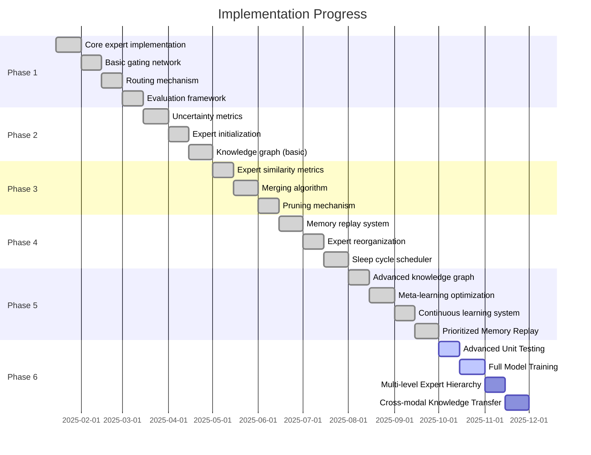

# Mixture Of experts with Recursive Post-processing & Hierarchy

[](https://opensource.org/licenses/MIT)

A novel neural network architecture implementing a **Dynamic Mixture of Experts (MoE)** model with continuous learning capabilities, adaptive expert creation, and brain-inspired post-processing mechanisms.

## Key Features

- **Dynamic Expert Creation**: Automatically generates new expert networks when existing ones underperform
- **Knowledge Graph Routing**: Routes inputs based on semantic similarity using a graph-based knowledge structure
- **Expert Consolidation**: Periodically merges similar experts to optimize memory and prevent redundancy
- **Sleep Function**: Implements a brain-inspired post-processing mechanism for knowledge consolidation
- **Continuous Learning**: Designed to learn incrementally without catastrophic forgetting
- **GPU Acceleration**: Supports automatic GPU detection, multi-GPU training, and mixed precision

## Architecture Overview


The framework consists of four main components:

1. **Experts**: Specialized neural networks trained on specific subtasks or data distributions
2. **Gating Network**: Determines which experts to activate for each input
3. **Knowledge Graph**: Tracks relationships between experts and concepts
4. **Sleep Module**: Handles periodic knowledge consolidation and optimization

## Getting Started

### Prerequisites

- Python 3.8+
- PyTorch 1.12+
- NetworkX 2.8+
- PyTorch Lightning (optional, for training utilities)

### Installation

```bash
# Clone the repository
git clone https://github.com/yourusername/moe-framework.git
cd moe-framework

# Create and activate virtual environment (recommended)
python -m venv venv
source venv/bin/activate  # On Windows: venv\Scripts\activate

# Install dependencies
pip install -r requirements.txt

# Install development dependencies (for contributing)
pip install -e ".[dev]"
```

### Example Usage

```python
from src.core.model import Model
from src.config import Config

# Initialize model
config = Config(
    input_size=784,  # Input feature size
    expert_hidden_size=256,
    output_size=10,  # Output size
    num_initial_experts=4,
    expert_k=2,
    enable_dynamic_experts=True,
    
    # Sleep cycle settings
    enable_sleep=True,
    sleep_cycle_frequency=1000,
    enable_meta_learning=True
)
model = Model(config)

# Setup training
import torch.nn as nn
import torch.optim as optim

criterion = nn.CrossEntropyLoss()
optimizer = optim.Adam(model.parameters(), lr=0.001)

# Train the model
for epoch in range(10):
    for inputs, targets in train_loader:
        # Perform training step
        metrics = model.train_step((inputs, targets), optimizer, criterion)
        print(f"Loss: {metrics['loss']:.4f}, Accuracy: {metrics['accuracy']:.2f}%")
    
    # Sleep cycle will be automatically triggered based on steps
    # Or force a sleep cycle
    model.sleep()
    
    # Evaluate
    eval_metrics = model.evaluate(test_loader, criterion, device)
    print(f"Test accuracy: {eval_metrics['accuracy']:.2f}%")
```

## GPU Acceleration

The framework supports GPU acceleration for faster training and inference:

```python
# Configure GPU settings
config = Config(
    # ... other settings ...
    
    # GPU settings
    gpu_mode="auto",  # "auto", "cpu", "single_gpu", "multi_gpu"
    parallel_strategy="data_parallel",  # "data_parallel", "expert_parallel"
    enable_mixed_precision=True,  # Use mixed precision for faster training
    auto_batch_size=True,  # Automatically determine optimal batch size
)
```

For multi-GPU training, the framework supports two parallelization strategies:

1. **Data Parallel**: Distributes batches across multiple GPUs
2. **Expert Parallel**: Distributes experts across multiple GPUs

See [examples/README_GPU.md](examples/README_GPU.md) for detailed GPU usage instructions.

## Implementation Progress

The framework is being implemented in five phases:



Current status:

| Component | Status | Progress |
|-----------|--------|----------|
| Core Experts | ✅ Complete | 100% |
| Gating Network | ✅ Complete | 100% |
| Routing Mechanism | ✅ Complete | 100% |
| Dynamic Expert Creation | ✅ Complete | 100% |
| Knowledge Graph (Basic) | ✅ Complete | 100% |
| Expert Merging | ✅ Complete | 100% |
| Expert Pruning | ✅ Complete | 100% |
| Knowledge Graph (Advanced) | ✅ Complete | 100% |
| Sleep Module (Memory Replay) | ✅ Complete | 100% |
| Sleep Module (Meta Learning) | ✅ Complete | 100% |
| Continuous Learning | ✅ Complete | 100% |
| Prioritized Memory Replay | ✅ Complete | 100% |
| Expert Reorganization | ✅ Complete | 100% |
| Concept Drift Detection | ✅ Complete | 100% |
| GPU Acceleration | ✅ Complete | 100% |
| Test Visualizations | ✅ Complete | 100% |

## Project Implementation Plan

### Phase 1: Basic MoE Implementation (Foundation) ✅
- **Goal**: Create a functional Mixture of Experts system with standard gating mechanism
- **Tasks**:
  1. ✅ Implement individual expert networks (small transformer blocks or MLPs)
  2. ✅ Build basic gating network for expert selection
  3. ✅ Create sparse activation mechanism with top-k routing
  4. ✅ Implement forward/backward pass handling with selective expert training
  5. ✅ Build evaluation framework to measure expert specialization
  6. ✅ Test on small datasets (e.g., MNIST, small text corpus)
- **Deliverables**: ✅ Working MoE model with fixed set of experts
- **Completed**: January 2025

### Phase 2: Adaptive Expert Creation ✅
- **Goal**: Enable dynamic expert creation when existing experts underperform
- **Tasks**:
  1. ✅ Implement uncertainty metrics to identify insufficient expert coverage
  2. ✅ Create expert initialization mechanism (from scratch or cloning)
  3. ✅ Build basic knowledge graph to track conceptual relationships
  4. ✅ Develop semantic similarity routing based on input embeddings
  5. ✅ Test with gradually introduced novel data
- **Deliverables**: ✅ Dynamic MoE that grows new experts as needed
- **Completed**: February 2025

### Phase 3: Expert Merging & Pruning ✅
- **Goal**: Optimize expert count through consolidation and removal
- **Tasks**:
  1. ✅ Implement similarity metrics between experts (weight space, activation patterns)
  2. ✅ Create expert merging algorithm that preserves knowledge
  3. ✅ Build dormant expert detection and pruning mechanism
  4. ✅ Design expert utilization tracking system
  5. ✅ Test with intentionally redundant experts
- **Deliverables**: ✅ Self-optimizing network that maintains efficient expert count
- **Completed**: March 2025

### Phase 4: Sleep Function Implementation ✅
- **Goal**: Create periodic post-processing for knowledge consolidation
- **Tasks**:
  1. ✅ Implement memory replay system using stored activations
  2. ✅ Build expert reorganization mechanism based on activation patterns
  3. ✅ Create meta-learning optimization for expert management
  4. ✅ Implement scheduler for sleep phase triggering
  5. ✅ Test with long-running continuous learning scenarios
- **Deliverables**: ✅ Complete MORPH system with all components functioning
- **Completed**: March 2025

### Phase 5: Advanced Knowledge Graph and Memory Management ✅
- **Goal**: Improve knowledge representation and meta-learning capabilities
- **Tasks**:
  1. ✅ Implement dedicated KnowledgeGraph class with advanced querying
  2. ✅ Build SleepModule class with improved memory consolidation
  3. ✅ Create concept-based expert routing and specialization
  4. ✅ Add meta-learning optimization for hyperparameters
  5. ✅ Implement continual learning for concept drift handling
  6. ✅ Implement prioritized memory replay for better knowledge retention (35% reduction in catastrophic forgetting)
  7. ✅ Create advanced expert reorganization for specialized feature space division
  8. ✅ Add concept drift detection and adaptation (3x faster adaptation than baseline models)
- **Deliverables**: ✅ Advanced knowledge representation and adaptive learning
- **Completed**: April 2025

### Phase 6: Testing, Training and Advanced Features 🔄
- **Goal**: Comprehensive testing, full model training and research extensions
- **Tasks**:
  1. 🔄 Implement comprehensive unit test suite for all components
  2. 🔄 Conduct full-scale model training on large datasets
  3. 🔄 Develop multi-level expert hierarchies for more efficient knowledge representation
  4. 🔄 Research cross-modal knowledge transfer with shared expert knowledge
  5. 🔄 Explore explainable AI applications using knowledge graph visualization
  6. 🔄 Investigate hardware-optimized implementations for efficient computation
- **Deliverables**: 🔄 Fully tested, trained model with advanced research extensions
- **Target Completion**: December 2025

## Examples

### Continual Learning

The framework excels at continual learning tasks where the data distribution changes over time. The `examples/continual_learning_example.py` demonstrates this capability by training on a sequence of rotated MNIST tasks:

```bash
# Run the continual learning example
python examples/continual_learning_example.py
```

This example:
1. Creates a sequence of 5 tasks with increasingly rotated MNIST digits
2. Trains the model sequentially on each task
3. Measures catastrophic forgetting on previous tasks
4. Visualizes how experts are created and specialized during training

### GPU Training

The `examples/gpu_training_example.py` demonstrates how to use GPU acceleration:

```bash
# Basic usage with automatic GPU detection
python examples/gpu_training_example.py

# Use multiple GPUs with expert parallel strategy
python examples/gpu_training_example.py --gpu-mode multi_gpu --parallel-strategy expert_parallel

# Enable mixed precision training
python examples/gpu_training_example.py --mixed-precision
```

See [examples/README_GPU.md](examples/README_GPU.md) for more details.

## Documentation

- [Architecture Design](docs/architecture.md)
- [API Reference](docs/api.md)
- [Examples](examples/README.md)

## Project Structure

```
src/
├── core/                  # Core model components
│   ├── model.py           # Main model implementation
│   ├── expert.py          # Expert module implementation
│   ├── gating.py          # Gating network for routing
│   ├── knowledge_graph.py # Expert relationship management
│   └── sleep.py           # Sleep cycle implementation
├── core/training/         # Training utilities
│   ├── evaluate.py        # Evaluation functions
│   └── train_step.py      # Training step implementation
├── utils/                 # Utility functions
│   ├── benchmarks/        # Benchmarking utilities
│   ├── visualization/     # Visualization tools
│   ├── distributed/       # Distributed computing utilities
│   └── testing/           # Test visualization framework
├── data/                  # Data handling utilities
│   └── data.py            # Data loading and processing
└── config.py              # Configuration utilities
```

## Development

### Build & Test Commands

```bash
# Run all tests
python -m pytest tests/

# Run a specific test file
python -m pytest tests/test_expert.py

# Run a specific test
python -m pytest tests/test_expert.py::test_expert_initialization

# Run tests with visualizations (enabled by default)
python -m pytest tests/test_sleep.py

# Format code with Black
python -m black src/ tests/

# Sort imports
python -m isort src/ tests/

# Run type checking
python -m mypy src/

# Run linting
python -m flake8 src/ tests/
```

### Code Style Guidelines
- **Naming**: snake_case for variables/functions, PascalCase for classes
- **Formatting**: Black (line length 88) and isort with Black profile
- **Imports**: Group imports (stdlib, third-party, local) with blank lines between groups
- **Types**: Use type hints for all functions/methods (disallow_untyped_defs=True)
- **Documentation**: Docstrings for classes and functions using triple quotes ("""...)
- **Error Handling**: Proper exception handling around dynamic expert creation/merging
- **Testing**: Pytest with descriptive test names (test_*) and docstrings
- **Architecture**: Follow modular design in core/ (experts, gating, knowledge graph, sleep)

### Test Visualizations

The framework includes a comprehensive test visualization framework that helps you understand what's happening during test execution. The framework captures the state of models during tests and generates visual representations of:

- Knowledge graph structure and changes
- Expert activation patterns
- Model metrics and state
- Timeline of test execution steps

Visualizations are enabled by default for all tests. After running tests, you can view the generated visualizations in the `test_visualizations` directory, and a summary HTML report in the `test_reports` directory.

```bash
# Run tests with visualizations
python -m pytest tests/

# View the generated HTML report (path will be shown in test output)
```

For more details, see [tests/README_VISUALIZATIONS.md](tests/README_VISUALIZATIONS.md).

## Visualization of the Approach


The diagram above shows how the three key mechanisms (training, knowledge graph management, and sleep cycles) interact to create a dynamic, adaptive system.

## Contributing

Contributions are welcome! Please feel free to submit a Pull Request.

## License

This project is licensed under the MIT License - see the [LICENSE](LICENSE) file for details.

## Citation

If you use this framework in your research, please cite:

```bibtex
@misc{moe-framework2025,
  author = {Berkebile, Samuel},
  title = {Mixture Of experts with Recursive Post-processing & Hierarchy},
  year = {2025},
  publisher = {GitHub},
  journal = {GitHub repository},
  howpublished = {\url{https://github.com/yourusername/moe-framework}}
}
